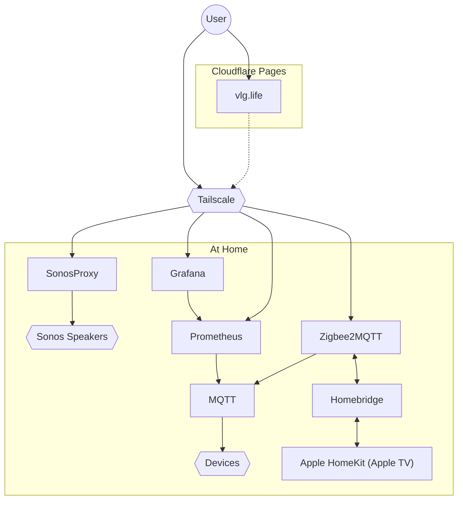

## Zigbee Network

| Device                                                                                                                | Count |
|-----------------------------------------------------------------------------------------------------------------------|-------|
| 🌡 [Aqara Weater](https://www.zigbee2mqtt.io/devices/WSDCGQ11LM.html#xiaomi-wsdcgq11lm)                               | 5     |
| 🚪 [Aqara Contact](https://www.zigbee2mqtt.io/devices/MCCGQ11LM.html#xiaomi-mccgq11lm)                                | 2     |
| 💡 [IKEA Tradfri 30W Driver](https://www.zigbee2mqtt.io/devices/ICPSHC24-30EU-IL-1.html#ikea-icpshc24-30eu-il-1)      | 2     |
| 💡 [Philips Hue E27 Color](https://www.zigbee2mqtt.io/devices/9290022166.html#philips-9290022166)                     | 3     |
| 💡 [Philips Hue Smart Plug](https://www.zigbee2mqtt.io/devices/929002240401.html#philips-929002240401)                | 1     |
| 💡 [Philips Hue Signe Floor Light](https://www.zigbee2mqtt.io/devices/4080248U9.html#philips-4080248u9)               | 1     |
| 💡 [Philips Hue E27 White Filament Bulb](https://www.zigbee2mqtt.io/devices/8718699688882.html#philips-8718699688882) | 1     |
| 🎛 [Philips Hue Dimmer Switch](https://www.zigbee2mqtt.io/devices/324131092621.html#philips-324131092621)             | 2     |
| 🎛 [IKEA Tradfri On/Off](https://www.zigbee2mqtt.io/devices/E1743.html#ikea-e1743)                                    | 2     |
| 🏃‍♂️ [IKEA Tradfri Motion Sensor](https://www.zigbee2mqtt.io/devices/E1525_E1745.html#ikea-e1525%252Fe1745)          | 4     |
| 💡 [Gledoptro Triac AC Dimmer](https://www.zigbee2mqtt.io/devices/GL-SD-001.html#gledopto-gl-sd-001)                  | 3     |
| 💡 [Sunricher SR-ZG9040A Dimmer](https://www.zigbee2mqtt.io/devices/SR-ZG9040A.html#sunricher-sr-zg9040a)             | 1     |
| 💡 [Schneider Electric WDE002334](https://www.zigbee2mqtt.io/devices/WDE002334.html#schneider%2520electric-wde002334) | 1     |
| **SUM**                                                                                                               | 28    |

## Network

